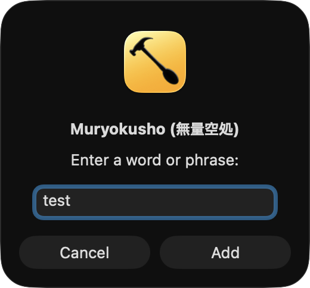

# Muryokusho (無量空処).spoon

Hammerspoon Spoon that prompts for a word, translates it via OpenAI, shows the result on screen, and adds it to Anki automatically.



- Global hotkey — works from any app
- Translates with OpenAI Chat Completions
- Shows translation alert on screen (dismissed by click, any key, or timeout)
- Adds a card to Anki via [AnkiConnect](https://ankiweb.net/shared/info/2055492159)
- API key stored securely in macOS Keychain

## Prerequisites

- [Hammerspoon](https://www.hammerspoon.org/)
- [Anki](https://apps.ankiweb.net/) with the [AnkiConnect](https://ankiweb.net/shared/info/2055492159) add-on (default port 8765)
- OpenAI API key

## Installation

Install [Hammerspoon](https://www.hammerspoon.org/) first if you haven't:

```bash
brew install --cask hammerspoon
```

### 1. Store your OpenAI API key in Keychain

Run once in Terminal:

```bash
security add-generic-password -a "muryokusho" -s "openai-api-key" -w "sk-..."
```

### 2. Install the Spoon

Download [Muryokusho.spoon.zip](https://github.com/masaki39/muryokusho/raw/main/Spoons/Muryokusho.spoon.zip), open it to install, and add to `~/.hammerspoon/init.lua`:

```lua
hs.loadSpoon("Muryokusho")
spoon.Muryokusho:start()
spoon.Muryokusho:bindHotkeys({ addCard = { {"ctrl", "alt"}, "w" } })
```

<details>
<summary>🚀 Via SpoonInstall</summary>

Download [SpoonInstall.spoon.zip](https://github.com/Hammerspoon/Spoons/raw/main/Spoons/SpoonInstall.spoon.zip) and open it to install if you haven't.

Add to `~/.hammerspoon/init.lua`:

```lua
hs.loadSpoon("SpoonInstall")
spoon.SpoonInstall.repos.muryokusho = {
    url    = "https://github.com/masaki39/muryokusho",
    desc   = "Muryokusho Spoon repository",
    branch = "main",
}
spoon.SpoonInstall:andUse("Muryokusho", {
    repo  = "muryokusho",
    start = true,
    config = {
        ankiDeck       = "Default",      -- Anki deck name
        ankiModelName  = "Basic",        -- Anki note type
        ankiFrontField = "Front",        -- front field name
        ankiBackField  = "Back",         -- back field name
        openaiModel    = "gpt-4.1-nano", -- OpenAI model
        targetLanguage = "Japanese",     -- translation target language
        allowDuplicate = false,          -- allow duplicate Anki cards
        alertDuration  = 6,              -- seconds to show alert (click/key also dismisses)
        -- customPrompt = nil,           -- set to override the built-in system prompt
    },
    hotkeys = {
        addCard = { {"ctrl", "alt"}, "w" },
    },
})
```

</details>

## Configuration

| Property | Default | Description |
|----------|---------|-------------|
| `ankiDeck` | `"Default"` | Anki deck name |
| `ankiModelName` | `"Basic"` | Anki note type |
| `ankiFrontField` | `"Front"` | Front field name |
| `ankiBackField` | `"Back"` | Back field name |
| `openaiModel` | `"gpt-4.1-nano"` | OpenAI model |
| `targetLanguage` | `"Japanese"` | Translation target language |
| `customPrompt` | `nil` | Override built-in system prompt |
| `allowDuplicate` | `false` | Allow duplicate Anki cards |
| `alertDuration` | `6` | Seconds to show translation alert (click or any key also dismisses) |

## Usage

1. Press the hotkey
2. Type a word or phrase in the dialog, then click Add
3. Translation appears on screen — click or press any key to dismiss
4. Card is added to Anki automatically

## Version Management (for developers)

```bash
chmod +x version.sh   # first time only
./version.sh patch    # patch bump (default)
./version.sh minor
./version.sh major
git push && git push --tags
```
